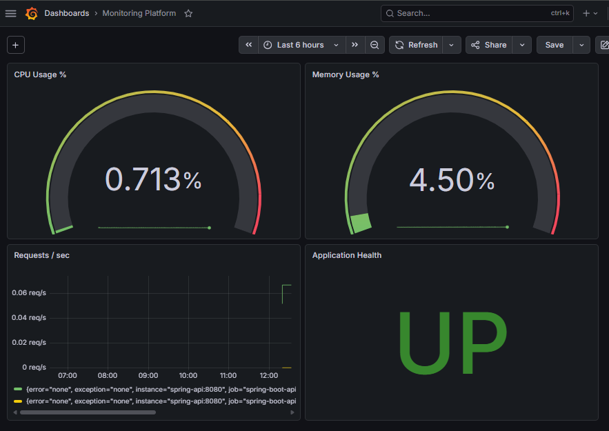

# DevOps Monitoring Platform

A production-grade observability platform built with modern DevOps tools. This project demonstrates the full lifecycle of deploying and monitoring a cloud-native application.



## Architecture

```
┌─────────────────────────────────────────────────────┐
│                    AWS EC2 (Terraform)               │
│                                                     │
│  ┌──────────────┐    ┌────────────┐                 │
│  │ Spring Boot  │───▶│ Prometheus │                 │
│  │     API      │    │  :9090     │                 │
│  │    :8080     │    └─────┬──────┘                 │
│  └──────┬───────┘          │                        │
│         │            ┌─────▼──────┐                 │
│  ┌──────▼───────┐    │  Grafana   │                 │
│  │  PostgreSQL  │    │   :3000    │                 │
│  │    :5432     │    └────────────┘                 │
│  └──────────────┘                                   │
└─────────────────────────────────────────────────────┘
```

## Tech Stack

| Layer | Technology |
|---|---|
| Application | Spring Boot 3.2, Java 17 |
| Metrics | Micrometer + Prometheus |
| Visualization | Grafana |
| Database | PostgreSQL 15 |
| Containerization | Docker + Docker Compose |
| Infrastructure | Terraform (AWS EC2) |
| Configuration | Ansible |
| Orchestration | Kubernetes |

## Features

- REST API with custom Micrometer metrics
- Real-time dashboard showing CPU, memory, request rate, and app health
- Automated infrastructure provisioning with Terraform
- One-command server configuration with Ansible
- Kubernetes manifests for container orchestration
- PostgreSQL monitoring via postgres-exporter

## Quick Start

### Prerequisites
- Docker Desktop
- Java 17+

### Run locally
```bash
docker-compose up --build
```

### Access services
| Service | URL | Credentials |
|---|---|---|
| Spring Boot API | http://localhost:8080 | - |
| Prometheus | http://localhost:9090 | - |
| Grafana | http://localhost:3000 | admin / admin123 |

## API Endpoints

| Endpoint | Method | Description |
|---|---|---|
| `/api/status` | GET | Application health status |
| `/api/metrics/summary` | GET | JVM metrics summary |
| `/actuator/health` | GET | Spring Boot health check |
| `/actuator/prometheus` | GET | Prometheus metrics scrape endpoint |

## Infrastructure

### Provision AWS server
```bash
cd infrastructure/terraform
terraform init
terraform apply -var="key_name=your-key"
```

### Configure server with Ansible
```bash
ansible-playbook -i infrastructure/ansible/inventory.ini infrastructure/ansible/monitoring.yml
```

### Deploy to Kubernetes
```bash
kubectl apply -f kubernetes/
```

## Project Structure

```
├── app/                          # Spring Boot application
│   ├── src/
│   │   ├── main/java/            # Java source code
│   │   └── main/resources/       # application.properties
│   └── Dockerfile
├── infrastructure/
│   ├── terraform/                # AWS EC2 + Security Group
│   │   ├── main.tf
│   │   ├── variables.tf
│   │   └── outputs.tf
│   └── ansible/                  # Server configuration
│       ├── monitoring.yml
│       └── inventory.ini
├── kubernetes/                   # K8s manifests
│   ├── namespace.yaml
│   ├── spring-api.yaml
│   ├── postgres.yaml
│   ├── prometheus.yaml
│   └── grafana.yaml
├── monitoring/
│   ├── prometheus/               # Prometheus config
│   └── grafana/                  # Grafana dashboards
├── docs/                         # Screenshots
└── docker-compose.yml
```

## Grafana Dashboard

The custom dashboard displays:
- **CPU Usage %** — Gauge with threshold alerts
- **Memory Usage %** — JVM heap utilization
- **Requests/sec** — Real-time HTTP request rate
- **Application Health** — UP/DOWN status indicator

## Author

**Siwar Benjalleb** — [github.com/siwarbenjalleb](https://github.com/siwarbenjalleb)